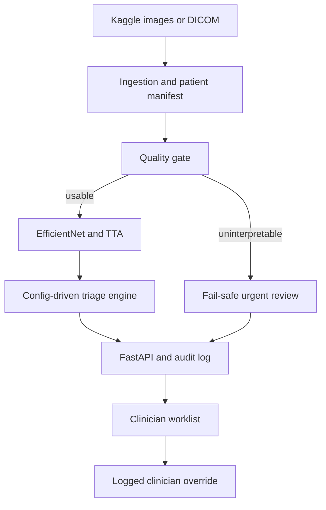

An end-to-end reference implementation for prioritizing retinal OCT (optical coherence tomography) studies for ophthalmologist review. It takes exported B-scan images and DICOM pixel data, runs them through a scan-quality gate, applies a transfer-learned classifier with test-time augmentation, maps the evidence to an editable urgency policy, and logs both predictions and human overrides for audit.
Built by Nathan Lee Yang.

Decision support only. This is an educational and research prototype, not an autonomous diagnostic system. It is not FDA-cleared or CE-marked and must not be used for patient care. Clinical deployment would need device-appropriate regulatory clearance, privacy and security controls, representative multi-site validation, and prospective clinical validation under qualified ophthalmology leadership.

What the current model can and cannot detect
The prototype trains on the Kermany OCT2017 Kaggle distribution, which covers four labels: CNV, DME, DRUSEN, and NORMAL. The architecture can accept additional findings, but the UI and API must not claim support for macular hole, retinal detachment, vitreomacular traction, or other conditions until there's patient-level data and validation to back it up.
OCT2017 doesn't give a reliable severity target, so DME severity is reported as UNKNOWN, and the fail-safe policy routes it to urgent review. Grad-CAM overlays show what influenced the network's activation. They're supporting visualizations, not causal explanations, and not proof that a finding is actually present.
## Architecture



The default policy lives in [`configs/triage_rules.yaml`](configs/triage_rules.yaml). No model
code contains urgency tiers. The engine validates that `HIGHEST_URGENCY_WINS` and
`allow_automatic_downgrade: false` remain active.

## Repository layout

| Path | Purpose |
|---|---|
| `configs/` | Model, quality-gate, and editable triage policies |
| `data/` | Ignored raw data, generated patient manifests, and small de-identified fixtures |
| `src/octtriage/data/` | Kaggle/DICOM ingestion, patient splitting, transforms, quality checks |
| `src/octtriage/models/` | EfficientNet/ResNet baseline, Grad-CAM, model registry |
| `src/octtriage/training/` | Class-weighted training selected by urgent-class recall |
| `src/octtriage/evaluation/` | Sensitivity, specificity, AUROC, urgent recall, confusion/calibration plots |
| `src/octtriage/triage/` | Deterministic fail-safe tier mapping |
| `api/` | Versioned REST endpoints and media delivery |
| `ui/` | Streamlit worklist, evidence viewer, and override workflow |
| `tests/` | Patient-leakage, quality, rules, audit, and API-contract tests |
| `model_registry/` | Model metadata; large checkpoints are ignored |
| `docker/` | API and UI container definitions |

## Local setup

Python 3.10 or newer is required.

```bash
python -m venv .venv
source .venv/bin/activate
pip install -e ".[dev]"
```

### 1. Obtain Kermany OCT2017 from Kaggle

The configured dataset is
[`paultimothymooney/kermany2018`](https://www.kaggle.com/datasets/paultimothymooney/kermany2018).
Authenticate through `kagglehub` if requested:

```bash
python -c "import kagglehub; kagglehub.login()"
oct-prepare-kermany
```

If Kaggle has already downloaded and extracted it:

```bash
oct-prepare-kermany --source /absolute/path/to/kermany2018
```

The preparation command searches the extraction, derives patient groups from the Kermany
filenames, and writes `data/manifests/kermany.csv`. It consolidates the upstream image folders
before rebuilding deterministic patient-level splits. Training refuses a manifest with patient
overlap. The source images are not copied into Git.

### 2. Train and evaluate

```bash
oct-train --manifest data/manifests/kermany.csv
oct-evaluate --manifest data/manifests/kermany.csv
```

The best checkpoint is selected primarily by validation recall across `CNV` and `DME`; validation
loss breaks ties. Evaluation writes per-class sensitivity, specificity, and AUROC plus urgent
recall, a confusion matrix, and a calibration plot under `reports/metrics/`.

No trained checkpoint is committed to this repository. Until training succeeds, `/health`
returns `model_ready: false` and inference returns HTTP 503 rather than fabricating a result.

### 3. Run the service and worklist

```bash
uvicorn api.main:app --reload
```

In another terminal:

```bash
streamlit run ui/app.py
```

Open `http://localhost:8501`. OpenAPI documentation is available at
`http://localhost:8000/docs`.

### 4. Run with Docker

Place a trained checkpoint at `model_registry/checkpoints/best.pt`, set a private DICOM hashing
salt, and start both services:

```bash
cp .env.example .env
docker compose up --build
```

The prototype uses SQLite on a persistent Docker volume as its lightweight worklist and audit
database. It stores content hashes and generated previews, but production use would require a
formal PHI handling, encryption, retention, access-control, and deletion design.

## API contract

Submit one PNG/JPEG/TIFF image or DICOM object:

```bash
curl -X POST http://localhost:8000/v1/triage \
  -F "study_id=DEIDENTIFIED-001" \
  -F "file=@scan.png"
```

Example response shape:

```json
{
  "audit_id": "42c2d7e6-8ac8-4980-91d6-ec6a307c8cc2",
  "study_id": "DEIDENTIFIED-001",
  "triage_tier": "URGENT",
  "confidence": 0.91,
  "findings": ["CNV"],
  "class_probabilities": {"CNV": 0.91, "DME": 0.05, "DRUSEN": 0.02, "NORMAL": 0.02},
  "saliency_map_url": "/v1/media/42c2d7e6-8ac8-4980-91d6-ec6a307c8cc2-saliency.png",
  "thumbnail_url": "/v1/media/42c2d7e6-8ac8-4980-91d6-ec6a307c8cc2-thumbnail.png",
  "model_version": "octtriage-20260904T180000Z",
  "timestamp": "2026-09-04T18:01:04+00:00",
  "quality": {"passed": true, "reasons": [], "metrics": {}},
  "escalation_reasons": [],
  "requires_clinician_review": true,
  "requires_repeat_acquisition": false,
  "disclaimer": "Clinical decision-support prototype. This output is not a diagnosis..."
}
```

Every successful inference is written to the audit database with its request SHA-256, quality
assessment, model version, result, timestamp, and evidence paths. `POST /v1/overrides` requires a
clinician identifier and reason and never destroys the original model decision.

## Fail-safe behavior

- Low confidence, high entropy, or test-time-augmentation disagreement escalates to `URGENT`.
- An uninterpretable scan is not forced through the classifier; it becomes urgent human review
  with a repeat-acquisition flag.
- Candidate CNV or DME probabilities can promote a case even when they are not the argmax class.
- When findings disagree, the highest urgency wins.
- Automatic downgrade is disabled. Only a logged clinician override can change the displayed tier.

Thresholds in this repository are conservative engineering defaults, not clinically validated
operating points. They must be selected and locked through representative validation before any
clinical study.

## Tests

```bash
ruff check .
pytest
```

CI runs linting and tests for every pull request. The deterministic tier mapping, patient-level
split invariant, API response contract, audit record, and override record receive direct tests.

See [`MODEL_CARD.md`](MODEL_CARD.md) for intended use, limitations, and evaluation requirements.
